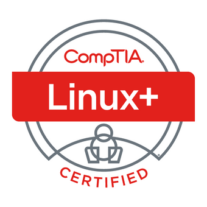

<p align="center"></p>

<h1 align="center">CompTIA Linux+ Certificate Notes</h1>

- [Users and Groups](#users-and-groups)
  - [Users: Create, Modify, and Delete](#users-create-modify-and-delete)
  - [Groups: Create, Modify, and Delete](#groups-create-modify-and-delete)
  - [Query Users and Groups](#query-users-and-groups)
  - [Account Profile](#account-profile)
- [Permissions and Ownership](#permissions-and-ownership)
  - [File and Directory Permissions](#file-and-directory-permissions)
  - [File and Directory Ownership](#file-and-directory-ownership)
  - [Special Permissions and Attributes](#special-permissions-and-attributes)
  - [Access Control Lists (ACLs)](#access-control-lists-acls)
  - [Troubleshooting Permissions Issues](#troubleshooting-permissions-issues)
- [Storage](#storage)
  - [File Systems](#file-systems)
  - [Partitioning](#partitioning)
  - [`/etc/fstab` file](#etcfstab-file)
  - [`etc/crypttab` file](#etccrypttab-file)
  - [Overall process for setting up storage on linux machines](#overall-process-for-setting-up-storage-on-linux-machines)
  - [`/dev` directory](#dev-directory)
  - [Storage Device Naming](#storage-device-naming)
  - [Special character devices in `/dev`](#special-character-devices-in-dev)


## Intro

- Multiple-choice and performance-based questions
- CompTIA Linux+ Text Book?
- Choose answers that are MOST right in MOST situations
- Most questions don't need specific syntax but reaonsing (what tool? why the tool)
- Official Overview: <https://partners.comptia.org/docs/default-source/resources/comptia-linux-xk0-005-exam-objectives-(1-0)>

## Preparation

- **Course**: *Udemy - CompTIA Linux+ Complete Course & Exam - Jason Dion*
- **Practice Exams** - *Udemy - CompTIA Linux+ Practice Exams - Jason Cannon*
- **Book** - *CompTIA Linux+ Study Guide - Richard Blum, Christine Breshahan*

## Linux Installation

- Different distribution have different requirements
- Mind intended system function
- Plan appropriate partitioning strategies
- Virtual/Swap memory partition -> Swap space [2x RAM]
- Linux must at least 1 file system (ie. root: `/`)
- Multiple file system ensures recovery/backup if one file system messes up
- Hardware
  - Not all hardware work on all linux distributions
  - Hardware Compatibility List (HCL) - Database that stores hardware devices that distro supports
  - Storage drive
    - Check how many devices can be installed
    - Technology interface
    - Controller used
    - Capacity
  - CPU
    - Server desktop market
    - Clock rate
    - Cache size
    - Hyper-threading support
  - Memory
    - How much physical RAM is installed
    - DDR SDRAM Generation
  - Network Card
    - Maximum bandwidth
    - Network technology supported
  - Input Devices
    - Mouse
    - Keyboard
    - USB support
  - Monitor
    - Refresh rate range
    - Maximum pixel resolution
  - Display Adapter
    - Chipset
    - Video RAM
    - Connection Interfaces integrated into the CPU
    - Graphics card
- Boot
  - Removable Media
  - Install ISO on local drive (also with virtual machines)
  - PXE and NFS
    - Fileserver on network
    - When booted up, will grabs installation files from insatllation file server
    - Great for automatic linux installation and setup
- Installation of Linux
  - Each distro has a installation program

### Install Linux in Virtual Machine with VirtualBox

- Download and install Oracle VirtualBox for your computer architecture
    - Link: TODO
- TODO

## Linux Design Pilosophy

- **Open Source** - Freely download, modify, and redistribute
  - GNU General Public License
  - Apache
  - MIT
  - Creative Common
- Proprietry - Licensed software that has restrictions for usage
- Distros
  - Ubuntu, Debian, Fedora, Mint, Kali, etc
  - CentOS is lite version of RedHat Enterprise Linux
- Simplicity and modularity
- Linux has a steeper learning curve
- Typically not well-supported
- No definite/official version
- No official vendor-provided support
- All based on linux kernel
  - Distros add things to linux kernel

## Command Line Interface (CLI)

- Instruction flow: User -> Shell -> Linux Kernel
- **sh** - Bourne shell (Original Unix)
- **bash** - Bourne-again shell
- Typical input: Command, Options, Arguments
- Basic commands
  - `ls` - list items
  - `cd` - change directory
  - `cp` - copies fiels or directiers
  - `mkdir` - make directory
  - `clear` - clear the screen
  - `cat` - view contents of file
  - `less` - view contents of file on one screen
  - ....

### Getting Help

- `man` pages - details to CLI commands
- `apropos` - search the name of section of all man pages
- `whatis` - display a brief description of the given command
- `info` - display information page of a command (similar to man pages)

# Users and Groups

- 3 types of accounts:

  1. **root**

  - Superuser
  - Admin tasks
    - password reset,
  - Provide security for some applications and commands
  - More powerful than local admin on windows
  - Do not log in as root user
  - ID (uid) is always 0

  2. **standard**

  - Regular system user
    - Runs applications
    - Configures databases
    - Creates websites
    - etc
  - Should not be shared with anyone
  - Exercise least privellage
    - Give users only as much access as needed to perform certain tasks

  3. **service**

  - Specific to the service (ie. web server, database)
  - No interactive login
  - Run in background
  - Often have configuration files
  - Perform a single function (ie. printer service)

- Always log into system with non-privelaged user account

- Substitute/Switch User

  - `su`
    - Switch user creds
    - `su - someuser`
  - `su -root` / `sudo su` - Switches to creds to root user
  - `sudo`
    - Enables server admin to delegate commands to users without full privelages
    - User of this command must be in `/etc/sudoers` file -> `visudo` editor needed to edit
  - `sudoedit`
    - Permits a user to edit a file with own creds, even if only available to root user
    - Any member in `editors` group to edit file
    - `%editors ALL = sudoedit /path/to/file`
  - `visudo`
    - DO NOT edit `/etc/sudoers` file with standard text editors
    - This command also verifies `/etc/sudoers` syntax before committing changes
    - `-c` - Check sudoers file for errors
    - `-f` - Edit or check sudoers file in different location than default location
    - `-s` - Check sudoers file in strict mode
    - `-x` - Output sudoers file in JSON form

- "Wheel" group

  - Members exercise root priileges with less potential for damaging the system
  - Can use `sudo` command to avoid signing in as root user
  - TODO: More explanation

- Polkit (PolicyKit)

  - Controls system-wide privileges that allows non-privileged processes to
    communicate with privileged ones
  - Allows for fine-grained control
  - Uses policy files (XML) that defines what is and is not allowed
  - Used in modern Linux desktop environments (GNOME, KDE)
  - `pkexec` - Execute command with elevated privileges
    - `pkexec mkdir /Jason`
  - **NOTE**: `sudo` may be easier to use instead of `pkexec`
  - Examples:
    - TODO

## Users: Create, Modify, and Delete

- Editing user accounts

  - `useradd [options] [username]`
    - Create new user account
    - Does not set a password for user account
    - `-c` - Full name of user
    - `-e` - Account expiration date
    - `-s` - Set default shell of created user
    - `-D` - View default configurations for new user (dry run)
  - `usermod`
    - Modify user account
    - Examples:
      - Change username: `sudo usermod --login my_new_username my_current_username`
      - Change user id: `sudo usermod --uid 7 ismet`
  - `userdel`
    - Delete a user account
    - **NOTE:** Doesn't automatically delete the user directory
    - Examples:
      - Delete user: `sudo userdel <USERNAME>`
      - Delete user with their home directory: `sudo userdel -r <USERNAME>`

- `passwd`
  - Used by `root` user to set or reset password for any user
  - A user can do this themselves
  - Set password for user
    - `sudo passwd <USERNAME>`
  - Lock/unlock user password
    - `sudo passwd --lock <USERNAME>`
    - `sudo passwd --unlock <USERNAME>`

- `/etc/passwd` file
  - File storing user account info
  - Does not contain actual passwords

- `/etc/shadow` file
  - Modern storage location for hashed passwords
  - Has additional account info
    - Username
    - Hashed password
    - Days since password changed
    - Days before password must be changed
    - Days until user is warned to change password
    - Days after password expires that account gets disabled
    - Days account has been disabled
    - Unused field for future use
  - Only root has access to this

- `chage`
  - Change user account and password expiry information
  - Change expiration of password
    - `sudo chage -E 2026/12/31` (<YEAR>/<MONTH>/<DAY>)
  - Information about user password (ie. exprirations)
    - `sudo chage -l <USERNAME>`

- `/etc/login.defs` file
  - Required file that defines the site-specific configuration for the shadow password suite.
  - Stores configurations for users accounts and groups
  - Configurations include:
    - Password aging controls
    - Min and max value for UID selection
    - Default umask
    - Encryption method used to encrypt passwords

## Groups: Create, Modify, and Delete

- Groups simplify admin tasks
- Groups have a group id number (gid)
- Users can be part of more than one group

- Editing groups

  - `groupadd [options] {group names}`
    - Create a group
    - `-g` - With friendly name or id
    - `-f` - Exit with success if group already exists
    - `-o` - Allow group with non-unique group id
    - Does not create members or passwords
  - `groupmod`
    - Modify a group
    - `-g` - change group id
    - `-n` - rename group
  - `groupdel`
    - Delete a group
    - Will not delete user accounts that are members of the group
    - `gropudel [options] <GROUP NAME>`

- `/etc/group`
  - Group information for all groups
  - Each group has four pieces of info
  - Example entry: `adm:x:4:syslog,ismet`
  - `<NAME>:<PASSWORD>:<ID>:<LIST>`
    - NAME - User-friendly name of group
    - PASSWORD - Required to enter this group (`x` means password stored in `/etc/gshadow`)
    - ID - Unique ID of the group
    - LIST - User accounts that are members of group (new group has no members)

- Adding a user account to a group
  - `sudo usermod -aG <GROUPS> <USER>`
  - `-a` or `--append` - Append user to group
  - `-G` or `--groups` - List of groups (comma seperated)

## Query Users and Groups

- `whoami`

  - Display the username of currently logged in user

- `who [options]`

  - Details of users currently logged in
  - `-u` - User idle time (`.` currently active user, `old` inactive for over 24 hours)
  - `am i` - Only information about user who ran the command

- `w [options] <username>`

  - Disdplay the details of users that are currently logged in to a system an their transactions
  - Output first line - Status of the system
  - Output second line - Table column list of users logged in the system
  - Output last column - Current activities of the users

- `last [options]`

  - Displays the history of user login and logout actions
  - Actual time and date
  - Retrieves info from the `/var/log/wtmp` file
  - Essentially what commands were run recently on a given system
  - `last 1` - Filter users logged into the first terminal

- `id [opstions] <username>`

  - Display user ID (uid) and group ID (gid) info
  - No options passed - Displays info about user currently logged in
  - Passing `<username>` will show the info about specific user

  - ```bash
    uid=1000(ismet) gid=1000(ismet) groups=1000(ismet),4(adm),24(cdrom),27(sudo),30(dip),46(plugdev),122(lpad
    min),134(lxd),135(sambashare),137(docker)
    ```

## Account Profile

- Allow users to customize their profile and settings
- User files eventually are within the user's home directory (ie. `/home/<USER>/`)
- Files are unique to each users
- Files starting with `.` are considered hidden files

- `.bashrc`

  - Enables customization of the user's own bash environment
  - Can specify command aliases here with `alias`
  - Create environment variable
  - Set default directories and file permissions
  - Change default command prompt

- `.bash_profile`

  - Provides the shell configuration for the initial login environment
  - Settings for all users' interactive shells
  - This file is read with first login _prior_ of using the `.bashrc`
  - Effectively part of `/etc/skel`
  - System-wide settings

- `/etc/skel/` *(directory)*

  - When new user is created, content of this directory is coppies into
    user's default home directory
  - Any files added after user creation to `/etc/skel` will not be copied over

- `/etc/profile`

  - Provides system-wide **environment variables** that are used to apply
    certain settings to user accounts
  - Only run at login

- `/etc/profile.d` *(directory)*

  - Storage location for scripts that admins may use to set
    additional system-wide variables
  - Set environment variables via scripts contained in this directory
    rather than editing `/etc/profile` directly for better control

- `/etc/bashrc`
  - System-wide configuration changes specific to bash settings
  - Bash settings for command-line environment
  - May also be `/etc/bash.bashrc`


# Permissions and Ownership

## File and Directory Permissions

- Permission

  - Access rights assigned to users that enable them to access
    or modify files and directories
  - Can be set at different levels and contexts
  - Who is allowed and restricted to access objects
  - Least privellage - Ony access what they need to access and nothing more

- `ls -l`

  - See all files and directories with their access permissions

  - ```bash
    drwxrwxr-x 2 ismet ismet    4096  Nov 20 20:19 .
    drwxrwxr-x 3 ismet ismet    4096  Nov 13 09:46 ..
    -rw-rw-r-- 1 ismet learners 11324 Nov 20 20:25 NOTES.md
    -rw-rw-r-- 1 root  hackers  1135  Nov 21 17:25 important.blah
    ```

  - Column 1 - Permission attribute string (ie. `-rw-rw-r--`)
  - Column 2 - Number of links to that file/directory
    - For directories it's number of sub-directories plus 2 (`.` and `..`)
    - Links are similar to shortcuts in windows
  - Column 3 - User Owner (ie. `ismet`)
  - Column 4 - Group granted access by admin (ie. `hackers`)
  - Column 5 - Size in bytes
  - Column 6 - Datetime file was created or modified
  - Column 7 - Name of file/directory

- **Permission Attributes**

  - Define what user are allowed to do in a particular file or directory
  - Depends if file or directory
  - Files
    - `r` - read - Access and view content
    - `w` - write - Ability to save changes / write to file
    - `x` - execute - Run script/program/software
  - Directories
    - `r` - read - List directory content
    - `w` - write - Create, rename, delete files
    - `x` - execute - Access directory and execute file from that directory or perform task

- **Permission Contexts**

  - Permission attributes apply to one of three contexts
  - `u` - owner - Owner of file or directory (a user). Can only do things that effect themselves
  - `g` - group - File or directory group. All users that belong to group have permissions
  - `o` - other - All other users. Not the owner and not the group member

- **Permission String**

  - Examples:
    - For File: `-rw-rw-r--`
    - For Directory: `drwxrwxr-x`
  - 11 characters long
    1. Type of file
       - `d` - directory
       - `-` - file
    2. Owner Permission - read (r)
    3. Owner Permission - write (w)
    4. Owner Permission - execute (x)
    5. Group Permission - read (r)
    6. Group Permission - write (w)
    7. Group Permission - execute (x)
    8. Other Permission - read (r)
    9. Other Permission - write (w)
    10. Other Permission - execute (x)
    11. Access method for the file
        - `.` - SELinux security context
        - `+` - Alternative access methods

- **Changing Permissions**

  - `chmod [options] {mode} {file/directory name}`
  - Enables the item owner or system admin (root) to modify the permissions of a file or directory
  - `-c` - Report changes
  - `-f` - Hide error messages
  - `-v` - Display diagnostic entry
  - `-R` - Recursively modify permissions
  - Supports two different modes:
    1. **Symbolic**
    2. **Absolute**
  - **chmod: Symbolic Mode**
    - `chmod {context}{operators}{attributes} {file/dir names}`
    - Example:
      - `chmod u+rw my_dir` - Give user rights to read and write
      - `chmod g-x my_file` - Remove exeuteable rights from group
    - Context - `u/g/o/a` - user/group/other/all ("who is affected")
    - Operators - `+/-/=` - grant/deny/exactly assign
    - Attributes - `r/w/x` - read/write/execute ("what can they do")
  - **chomd: Absolute Mode**
    - `chmod {number} {file/dir names}`
    - Uses octal (base-8) numbers to specify permissions
    - Each permission has a number associated with it, add up to get permission
      - `4` - read
      - `2` - write
      - `1` - Execute
    - Example:
      - `7` -> `421` -> read, write, execute
      - `6` -> `42` -> read, write
    - Complete final permission is a three-digit number that corresponds to
      the owner, group, and others (ie, `774`)
        - First digit: user
        - Second digit: group
        - Third digit: other
    - Example: `752`
      - `7` - user - read, write, execute
      - `5` - group - read, execute
      - `2` - othes - write

- `umask`
  - Used to set the default permissions for newly created files and directories
  - Manage read/write/execute permissions that are masked out (restricted) for
    newly created files by the user
  - Default Permissions: By default, Linux sets permissions for new files to
    666 (read and write for everyone) and for directories to
    777 (read, write, and execute for everyone).
  - `umask` acts like a filter. It subtracts permissions from the default set.
    So, if you set a umask of 022, it removes write permissions for the group
    and others. This means new files will have 644 (read and write for the
    owner, read-only for group and others) and directories will have
    755 (read, write, and execute for the owner, read and execute for group
    and others).
  - Can be set in `.bashrc` or `.bash_profile`
  - `umask -S` - Display symbolic value
  - `umask [mask]` - Setting umask for file and dir
  - Difference between `chmod` and `umask`
    - `umask` changes _default_ permissions for _newly_ created files and directories
    - `chmod` sets permissions on files and directories that _already exist_
  - Examples:
    - `umask a+r` - Take away read for all
    - `umask 020` - Take away write from group
    - `umask 077` - Take away read, write, and execute from group and other

## File and Directory Ownership

- Ownership
  - Property by which a user can apply and modify the permissions
    of a file or directory
- Only the superuser (root user) can change the permissions of an object
  owned by others
- Every file is owned by specific user and specific group

- **Changing Ownership**
  - `chown`
    - Change the owner and/or the group of a file or directory
    - `chown {username}:{group name} {file/directory name}`
    - `chown {username}:{group} {file/directory name}` - Change user and group owner
    - `chown {username} {file/directory name}` - Change user owner
    - `chown :{group name} {file/directory name}` - change group only
    - `chown {username}: {file/directory name}` - Change user owner and assign to user owner login group
    - `-R` - Recuirsively change ownership thoughout directory structure

  - `chgrp`
    - Change group ownership of a file or directory
    - `chgrp {group name} {file/directory name}`

## Special Permissions and Attributes

- Special permission - Less privileged users are allowed to execute a file
  by assuming the privileges of the file's owner or group

- Set user ID (SUID)
  - User is allowed to have similar permissions as the
    owner of the file
  - When a file has the setuid bit set, any user who runs that file will
    have the file executed with the permissions of the file's owner, not
    the user who ran the file.
- Set group ID (SGID)
  - User is allowed to have similar permissions as the
    group owner of the files and directories

- `ls -la` - Determining SUID/SGID
- Files can have one or more *attributes* set that define how the system
  interacts with them

- Can use `chmod` in symbolic (+s) or absolute mode
  - SUID Symbolic: `chmod u+s {filename}`  (Use `-` to remove)
  - SUID Absolute: `chmod 4### {filename}`  (Use `0###` to remove)
  - SGID Symbolic: `chmod g+s {directory name}`
  - SGID Absolute: `chmod 2### {directory name}`

- **Sticky Bit** (`+t`)
  - Special permission bit that protects files in a directory
  - Must be applied to the directory
  - Users may be able to write and execute, but can't delete items
  - Symoblic: `chmod +t {directory name}`
  - Absolute: `chmod 1### {directory name}`
    
- **Immutable Flag (`+i`)**
  - Attribute of a file or directory that prevents it from being modified
    (even by the root user)
  - Useful for fiels that are highly sensitive and important
  - File:   
    - Set: `chattr +i /path/to/file`
    - Unset: `chattr -i /path/to/file` 
  - Directory:
    - Set: `chattr +i -R /path/to/directory`
    - Unset: `chattr -i -R /path/to/directory`

  - `lsattr`
    - List the attributes of a file or directory
    - `lsattr [options] {file or directory name}`
    - `-R` - Recuirsively list attributes of items
    - `-a` - List all files
    - `-d` - List directories
    - `-v` - List file's version number

  - `chattr`
    - Used to change the attributes of a file or directory
    - `chattr [-R] [-v {version}] [+-{attributes}] {file or directory name}`
    - `-R` - Recursively change attributes
    - `-v` - Set file version number
    - `+I` - Mark file as read-only and immutable
    - `-I` - Remove read-only

## Access Control Lists (ACLs)

- Enable a more granular level of control than simply using file permissions
- Can set access to multple groups on one directory

- `getfacl`
  - Useful when retrieveing the ACLs of files and directories
  - Will show any permission attributes with object

- `setfacl`
  - Change the permissions associated with the ACL of a file or directory
  - `setfacl [-bR] [-mx {acl_spec}] {file/directory name}`
  - `-r` - Recuirsively set ACL options
  - `-S` - Set ACL
  - `-m` - Modify existing ACL
  - `-x` - Remove entries from exsisting ACL
  - `-b` - Remove all entries except standard permissions
  - acl_spec
    - Users: u:{username}: {permissions}
    - Group: g:{group name}: {permissions}
  - Example:
    - `sudo setfacl -R -m g:My-Group:r /My-Dir`

## Troubleshooting Permissions Issues

- CompTIA Troubleshooting steps
  1. Identify the problem
  2. Establish theory of probable cause
  3. Test the theory to determine the cause
  4. Establish an action plan
  5. Implement the solution
  6. Verify full system funcitonality
  7. Documment findings, actions, and outcomes

- `ls -la` - Check permissions and ownership
- `groups {username}` - Check user's group memebership
- `usermod` - Change group membership
- `lid`, `liduser-lid`
  - Retrieve all members of a group
- `getent`
  - Retrieve group members (or services) of non-standard authentication methods
  - `getent group`, `getent services`

- Critical steps
  1. Follow troubleshooting strategy
  2. Verify permissions and ownership (ie. `ls -la`)
  3. Verify special permissions are set properly (ie. sticky bits, immutable flags)
  4. Ensure proper owner and owning group set


# Storage

## File Systems

- Types of storage devices
    - Block Devices - Read/Write in blocks of data (e.g., hard drives, solid-state devices)
    - Character Devices - Read/Write character streams of data (e.g., keyboards, mice, serial ports)
- File System
    - Data structure used by an operating system to store, retrieve, organize, and manage files
      and directories on storage devices
    - Supported Linux file systems
        - `FAT` - File allocation Table - Older file system, used for compatibility
        - `ext2` - Used to be native linux file system on older releases
        - `ext3` - Faster in recovering data and better ensures data integrity of abrupt system shutdowns
        - `ext4` - Supports volumes up to 1 exabyte and files up to 16 terabytes in size
        - `XFS` - 64-bit, high-performance journaling file system that provides fast recovery and can handle large files efficiently
        - `BTRFS` - Modern filesystem. Supports volumes up to 16 exabytes in size and up to 18 quintillion files on each volume
    - File system protocols
        - Server Message Block (SMB)
            - Allows users to have access to files over the local network
            - Server-client architecture
            - Better for mixture of windows and linux filesystems
            - Microsoft Windows supports SMB by default
        - Common Internet File system (CIFS)
            - Some linux distribution refer to SMB as CIFS
            - Version of SMB, rarely in use today, replaced by later versions
        - Network File System (NFS)
            - Better for all linux networks and filesystems
            - Not supported by Microsoft Windows by default
    - Index Node (Inode)
        - Stores metadata about a file or directory on a file system
        - Can included time-based values (created, modified, etc), permisssion and ownership info,
    - Virtual File System (VFS)
        - Filesystem created as interface between kernel and real file system
        - Translates real file system details to kernel
        - Can mount many file systems on OS, and will apear uniform to system and applications
        - File system labels are used for easy identification and many be up to 16 characters long
        - Labels can be dispalyed or changed using the following commands
            - `e2label` - ext-based file system
            - `xfs_admin` - XFS-based file system


## Partitioning

- Partition - A section of the storage drive that logically acts as a seperate drive

- 3 Types of partitions
    1. Primary
        - Contains one file system or logical drive and is sometimes referred to as a volume
        - Examples: 
            - swap file system - Used as buffer for actual physical memory
            - boot partition
    2. Extended
        - Contains several file systems, which are referred to as logical drives
        - Does not contain data
        - Has seperate partition table
    3. Logical
        - Partitioned and allocated as an independent unit and functions as a seperate drive

- Modifying partitions
    - `fdisk`
        - Used to create, modify, or delete partitions on a storage drive
        - `-b` - Number of drive sectors
        - `-H` - Number of drive heads
        - `-S` - Number of sectors per track
        - `-s` - Print partition size in blocks
        - `-l` - List partition tables for devices
        - Within the `fdisk` menu:
            - `n` - Create new partitions
            - `d` - Remove paritition
            - `p` - List exixsting partitions
            - `w` - Write drive changes and exit utility
            - `q` - Cancel changes made and exit utility
    - `parted`
        - Partition manipulation program
        - Create, destroy, and resize partitions
        - Runs GNU parted utility
        - Can use interactive mode (ie. `sudo parted`)
            - `select` - choose device or partition to modify
            - `mkpart` - Create partition with file system type specified
            - `print` - List partition table
            - `resizepart` - Resize and modify a partition's end position
            - `rm` - Delete partition
            - `quit` - Quite interactive mode
    - `partprobe`
        - Update the kernel with changes that now exist within the partition table
        - If there are any changes, kernel is updated with those changes
        - Used after using `fdisk` or `parted`
    - `mkfs`
        - Build a Linux file system on a device, which is usually a drive partition
        - `-v` - Produce verbose output - Program process
        - `-V` - Produce verbose output - All file system-specific commands executed
        - `-t {fs type}` - Specify type of file system to build
        - `fs -options` - Pass system-specific options to the file system builder
        - `-c` - Check the device for bad blocks before building the file system
        - `-l {filename}` - Read the list of bad blocks from a specific file
        - Can run it two ways
            1. `mkfs [options] {device name}`
            2. `mkfs {file system type} [options] {device name}`

## `/etc/fstab` file

- Stores info about storage devices and partitions and where and how they should be mounted
- Config file that controls how file systems are treated when they are introduced to a system
- Read by system during boot up process
- Only edited by `root` user
- Each line in this file has 6 fields:
    - ```
      <file system> <mount point> <type> <options> <dump> <pass>
      ```
    - File system - Name of the device (UUID) or file system to mount (`/mnt/something`)
    - Mount Point - Where to mount file system (ie. `/home`)
    - File system type - Type of file system (ie. `ext4`, `swap`)
    - Options - Comma-seperated options that will be activated when the file system is mounted
    - Dump - If the dump utility should back up file system (0 or 1)
    - Pass - fsck options. Order in whic `fsck` utility should check file system

## `etc/crypttab` file

- Information about encrypted devices and partitions that must be unlocked and mounted
  on system boot
- Encrypted block devices that are set up during system boot
- ```
  <volume-name> <encrypted-device> <key-file> <options>
  ```

## Overall process for setting up storage on linux machines

1. Partition storage device (ie. `fdisk`, `parted`)
2. Format partition with a file system (ie. `mkfs`)
3. Add formatted partition to `/etc/fstab` file

## `/dev` directory

- Special file that contains details about all the files and subdirectories housed within it
- Everything in linux is treated as a file, even file systems

## Storage Device Naming

- `/dev/sda1` - Controller-based naming
    - `sd` - Type of controller
    - `a` - First whole physical drive (`a`, `b`, etc)
    - `1` - First paritition on drive (`1`, `2`, etc)
- `/dev/disk/by-id/<DEVICE_ID>`
    - Device's hardware serial number
    - Examples:
        - `/dev/disk/by-id/nvme-eui.6479a765c13012c5-part1`
        - `/dev/disk/by-id/nvme-ESE2A047-M24_NVMe_Phison_1024GB_1782073611ED00110458-part8`
- `/dev/disk/by-path/<PHYSICAL PATH`
    - Shortest physical path to the device
    - Example:
        - `/dev/disk/by-path/pci-0000:00:0e.0-pci-10000:e1:00.0-nvme-1-part1`
- `/dev/disk/by-uuid/<DEVICE UUID>`
    - Universally unique identifier (UUID)
    - Example:
        - `/dev/disk/by-uuid/5cb09b2f-53d2-4f43-a292-8ebe4d65371g`
- Other naming:
    - `/dev/disk/by-label/<DEVICE_LABEL>`

## Special character devices in `/dev`

- `/dev/null`
    - Virtual device that discards anything you send or redirect into it
    - Ie. a big black hole for data
    - Example usage:
        - Discard output: `echo "hello" > /dev/null`
        - Surpress errors: `touch file 2> /dev/null`
- `/dev/zero`
    - Returns a null character anytime you read from it
    - Send back the ASCII null character of 0x00
    - Example usage:
        - Sanitize hard drive: `dd if=/dev/zero of=/dev/sda1 bs=1GB count=1024`
- `/dev/urandom`
    - Returns a randomized series of pseudorandom numbers
    - Example usage:
        - Get 5 random characters: `head -c 5 /dev/urandom`
        - Generate secure token: `dd if=/dev/urandom  count=1 bs=128 | sha512sum`


